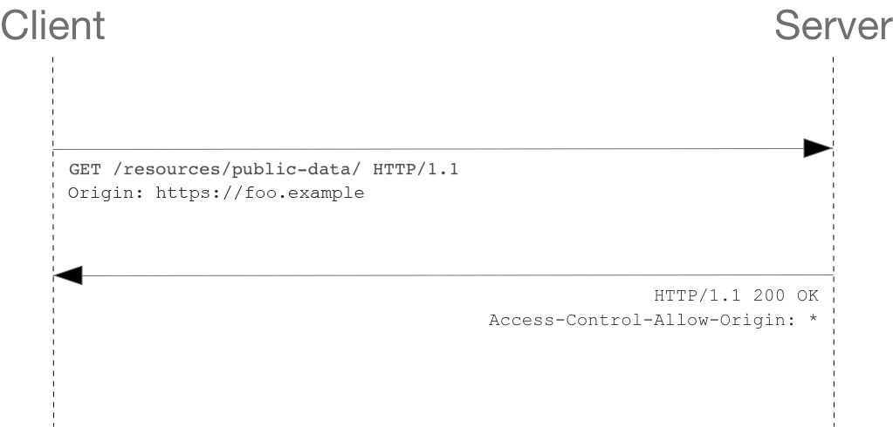

# SOP & CSP & CORS

Tags: Clinet Side
Multi-select: yashar

tools:

corsy - [s0md3v/Corsy: CORS Misconfiguration Scanner (github.com)](https://github.com/s0md3v/Corsy)

corsscanner - https://github.com/chenjj/CORScanner

---

### SOP - Same-Origin Policy

SOP is critical security Policy that control Origins.

### what is origin?

the web browser permits scripts contained in the first web page to access data in  a second web page, but only if both web page have the same origin 

SOP  composed by 3 things:

1-Domain 

2-Port

3-Schema

if any website has this 3 things same as together they are in **same origin**

| URL | Outcome | Reason |
| --- | --- | --- |
| http://store.company.com/dir2/other.html | Same origin | Only the path differs |
| http://store.company.com/dir/inner/another.html | Same origin | Only the path differs |
| https://store.company.com/page.html | Failure | Different protocol |
| http://store.company.com:81/dir/page.html | Failure | Different port (http:// is port 80 by default) |
| http://news.company.com/dir/page.html | Failure | Different host |

-now whats it up to CORS?

so cors is security mechanism that check and allow client can read or write data from other origin

so we can say **SOP is base of CORS** 

cors has two model simple request and preflight request 

### 1-Simple request



Simple Request only work with one of 3 bellow methods:

- `[GET](https://developer.mozilla.org/en-US/docs/Web/HTTP/Methods/GET)`
- `[HEAD](https://developer.mozilla.org/en-US/docs/Web/HTTP/Methods/HEAD)`
- `[POST](https://developer.mozilla.org/en-US/docs/Web/HTTP/Methods/POST)`

and in Simple we have only three content type:

- `application/x-www-form-urlencoded`
- `multipart/form-data`
- `text/plain`

when origin set in request from browser its sent to server and response set to 

access-control-allow-origin: *

example of javascript that run simple request:

```jsx
const xhr = new XMLHttpRequest();
const url = "https://bar.other/resources/public-data/";

xhr.open("GET", url);
xhr.onreadystatechange = someHandler;
xhr.send();
```

### 2-Preflight request


in preflight request the first method is **OPTION**

its work with other methods like DELETE and PUT or…

in request we have two important header 

```
Access-Control-Request-Method: POST
Access-Control-Request-Headers: X-PINGOTHER, Content-Type
```

and in the response we have this headers:

```
Access-Control-Allow-Origin: https://foo.example
Access-Control-Allow-Methods: POST, GET, OPTIONS
Access-Control-Allow-Headers: X-PINGOTHER, Content-Type
Access-Control-Max-Age: 86400
```

those above headers are named CORS headers.

if we are want pentest CORS - the request is must be coockie based.

now how fount out its coockie based?

see `Access-Control-Allow-Credentials` = true → allow coockies

if this is false means not coockie set and we cant pentest

### tips:

-if origin: * set to * we cant pentest

-for same-site=lax → we must set two things for lax 

the request method must be GET 

the TopLevelNavigation must be Done.

-cross site == cross origin

-SOP not set in few tags like `image` and `script`

- go to port swigger CORS lab and use it for pentest
- copy exploit and and use it for your self

### now how can we found out the cors is vulnerably or not?

if you change request origin greensazman.com

to 

redhacker.com

and the response control-allow-origin: redhacker.com

means [redhacker.com](http://redhacker.com) reflected as [greensazman.com](http://greensazman.com) 

so its vulnerable to CORS misconfiguration

Web page:

1- BOM: document, cookie, local storage … for speak browser

2- DOM: Window ,location, navigator and … for speak content

3- Javascript

**CORS TIPS:**

- use corsy and cors scanner to try bypass CORS configuration
- don't forget use auto repeater and logger++
- you can also set xss paylaod in cors misconfiguration

### Content Security Policy(CSP)

its a security mechanism like SOP

*must configured

prevents XSS and named extra security layer

example of config:

script-src [http://scripts.com](http://scripts.com) ⇒ you can only load scripts

img-src [http://pics.com](http://pics.com) ⇒ you can only load images

### RULE SET

same-site: in side cookie flag

cross-site: out side cookie flag