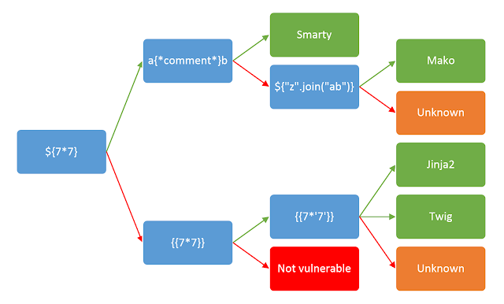

# SSTI

Tags: Server Side
Multi-select: yashar

Tools :tplmap

Server Side Template Injection (SSTI) also know as a type of injections

now what is it?

SSTI let us to inject some code or command to the template engine that use for the target site and roads to maybe RCE or XSS.

now why SSTI created?

some lazy programmer dosent have patient enough to program a site, so they decided to create some framework to work faster and effitient.

if the target site use frameworks like Django(python) and Spring(java) and they have template engine we can test the target.

the progress of finding the bug is more likely to XSS.

**you must set the payload to number or something else that's be unique** 

you must be aware of encoding and encode URL.

`http://vulnerable-website.com/?username=${7777*7777}`

### Tip

you can use **`${{<%[%'"}}%\.` to cause a error massage and identify the template engine in using.**

### The Methodology

Step 1 - found out the target using which framework and engine.

Step 2- if target using some framework that you know maybe rendering by template engine like jinja2 test it.

Step 3 - go on auto repeater and config request params value to the payload of TE (template engine) you found out like {{777*777}} or ${{7*7}} 

Step 4 - go for logger++ and set rule to found the answers of the * we injected

Step 5 - if its show something now its time to test manually and create the payload or you can exploit it with Tplmap tool.